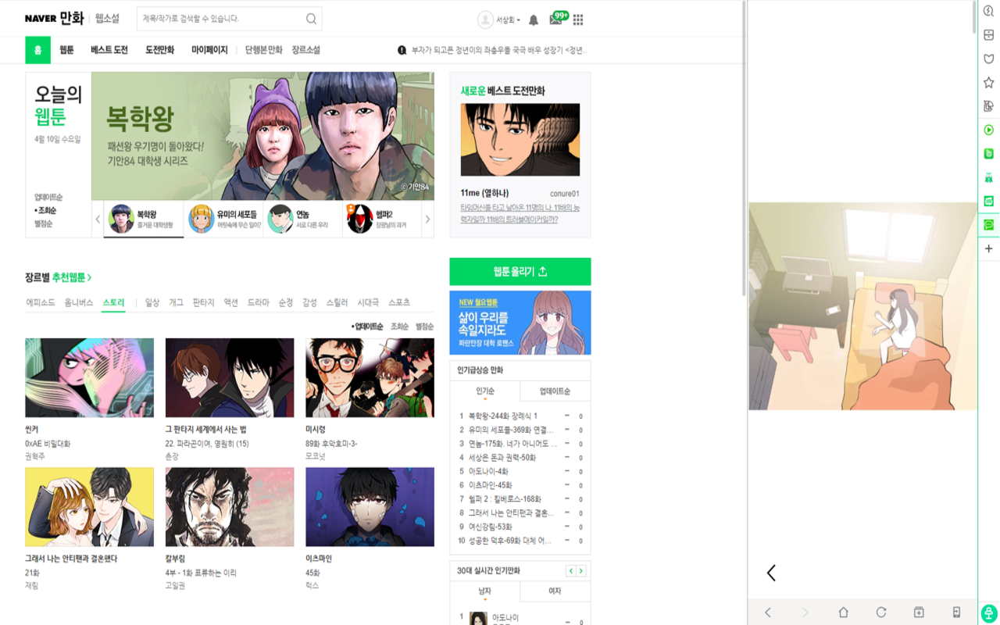
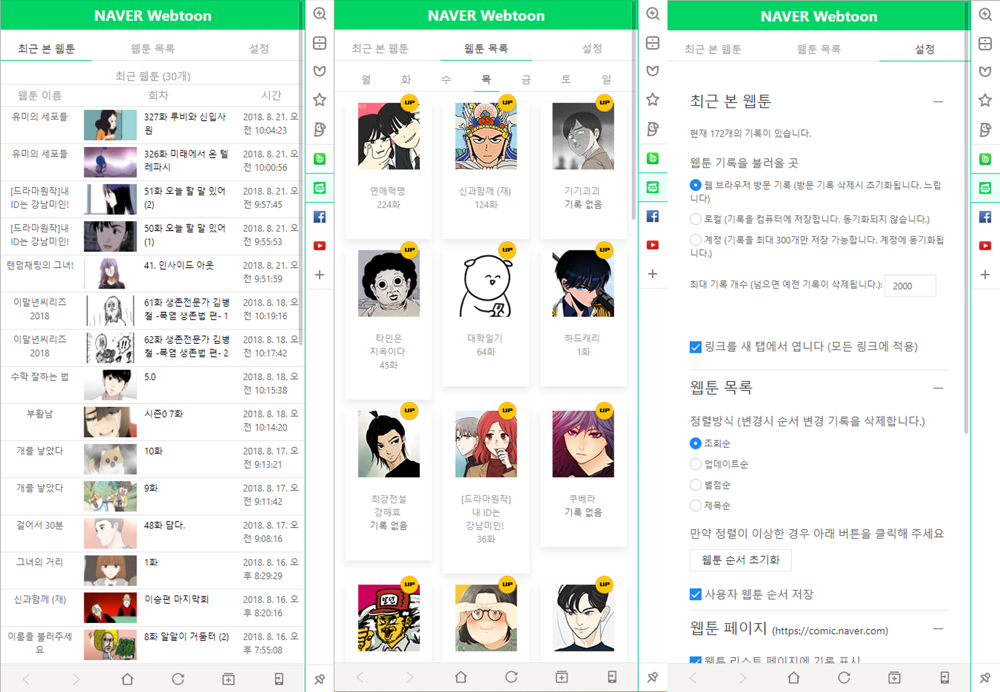
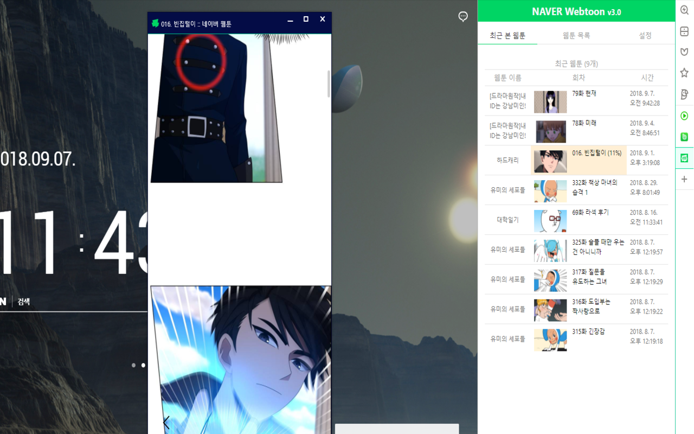
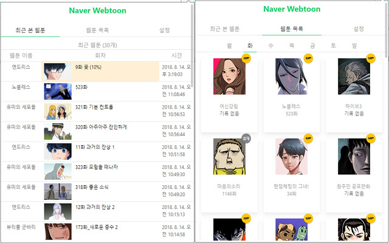
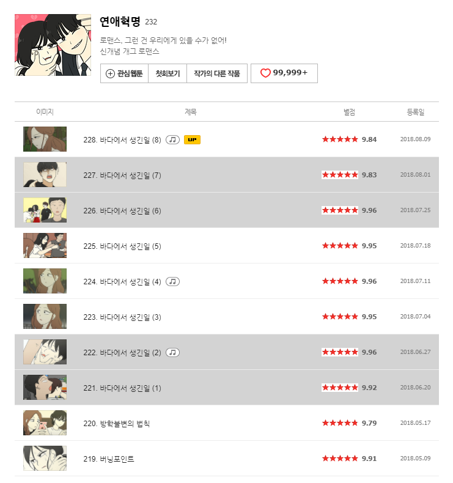

# Naver Webtoon Extension

| Chrome User                                                                                                                                                                                                                | Chrome V2 Build                                                                                                                                                                   | Whale User                                                                                                                               | Whale V2 Build                                                                                                                                                                   |
|:--------------------------------------------------------------------------------------------------------------------------------------------------------------------------------------------------------------------------:|:---------------------------------------------------------------------------------------------------------------------------------------------------------------------------------:|:----------------------------------------------------------------------------------------------------------------------------------------:|:--------------------------------------------------------------------------------------------------------------------------------------------------------------------------------:|
|  |  |  |  |

whale(chrome) extension 으로 네이버 웹툰 기록을 표시하고 쉽게 접근할 수 있는 extension입니다.

계속 기능을 업데이트 중이니 아이디어나 오류가 있으면 알려주시면 적극 반영하겠습니다.

Issues나 Pull requests 환영합니다.

**Issues를 달 시 앞에 사용중인 웹 브라우저를 명시해 주세요**

# Issues

1. [SoohanBae](https://github.com/SoohanBae) : [글자 짤림 오류](https://github.com/tbvjaos510/naver-webtoon-history/issues/1) - 수정 완료
2. [Jrady721](https://github.com/Jrady721) : [설치하고 10분 동안의 불편한 점](https://github.com/tbvjaos510/naver-webtoon-history/issues/4) - 적용 완료

# Pull requests

1. [kennyd98](https://github.com/kennyd98) : [Whale 확장앱 환경 추가](https://github.com/tbvjaos510/naver-webtoon-history/pull/3) - 2018-08-23 Merged 적용

모두 감사합니다.

# [Whale](https://store.whale.naver.com/detail/nmambboikkfejkgloppiejnhhohbaaem) 3.0v

# [Chrome](https://chrome.google.com/webstore/detail/naver-webtoon-extensions/pkingjioiemgjlbklighjcicnjgjckok?hl=ko) 2.0v

