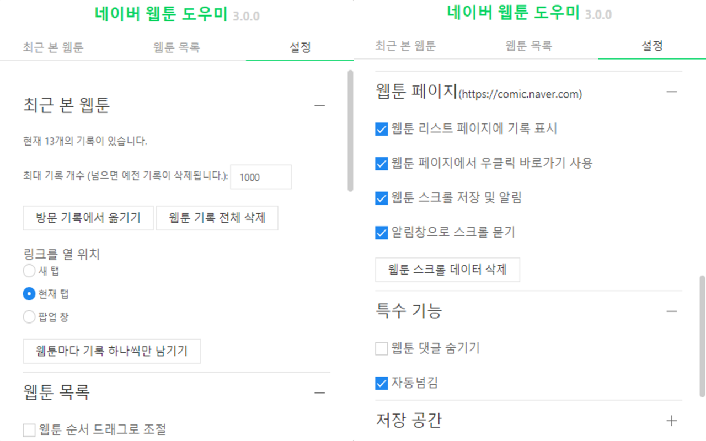
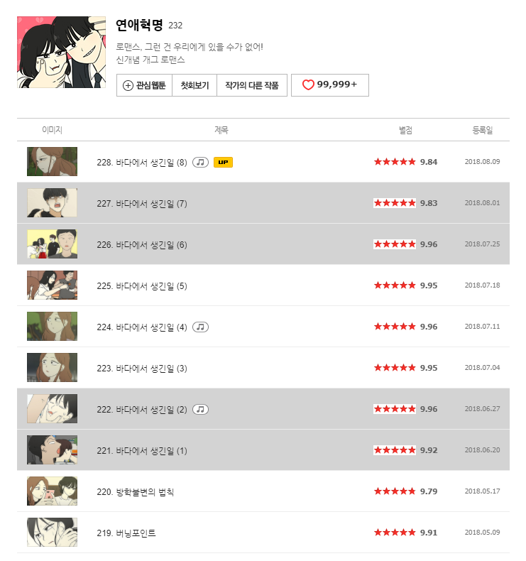

# Naver Webtoon Extension

[](https://travis-ci.org/tbvjaos510/naver-webtoon-history)
[](https://coveralls.io/github/tbvjaos510/naver-webtoon-history?branch=master)

| whale user                                                                                 | chrome user                                                                                                                        |
| ------------------------------------------------------------------------------------------ | ---------------------------------------------------------------------------------------------------------------------------------- |
|  |  |

whale(chrome) extension 으로 네이버 웹툰 기록을 표시하고 쉽게 접근할 수 있는 확장 앱니다.

계속 기능을 업데이트 중이니 아이디어나 오류가 있으면 알려주시면 적극 반영하겠습니다.

## Stack

- Typescript
- React
- MobX
- Webpack
- Jest (Unit Test)

## Run

```sh
yarn install # install

yarn build # build whale and chrome
yarn build:chrome # build chrome
yarn build:whale # build whale

yarn watch:chrome # watch chrome
yarn watch:whale # watch whale

yarn test # test
yarn test:coverage # test coverage
yarn test:watch # test watch

yarn lint # lint all code
```

## 이미지

## [Whale](https://store.whale.naver.com/detail/nmambboikkfejkgloppiejnhhohbaaem) [4.3.1v](https://github.com/tbvjaos510/naver-webtoon-history/releases/tag/whale-4.1.0)


## [Chrome](https://chrome.google.com/webstore/detail/naver-webtoon-extensions/pkingjioiemgjlbklighjcicnjgjckok?hl=ko) [3.2.1v](https://github.com/tbvjaos510/naver-webtoon-history/releases/tag/chrome-3.0.0)





